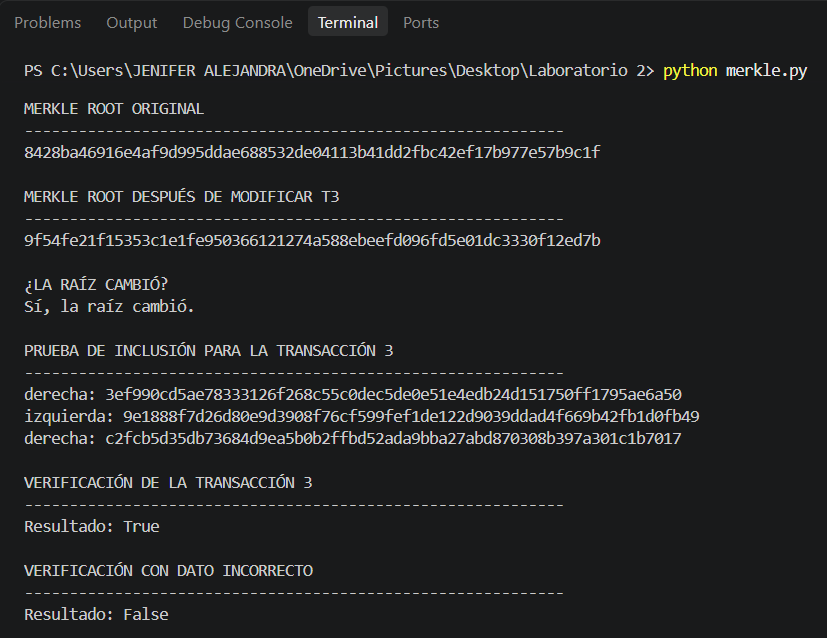

# Laboratorio 2 - Árbol de Merkle

## Estudiante: Jenifer Alejandra Davila Popayan 

## Descripción

En este laboratorio se implementó un Árbol de Merkle utilizando Python y el algoritmo de hash SHA-256.

El programa permite construir un árbol a partir de un conjunto de transacciones, calcular la Merkle Root, comprobar cómo cambia la raíz cuando se modifica una transacción y realizar pruebas de inclusión para verificar si una transacción pertenece al árbol.

## Objetivos

- Implementar un Árbol de Merkle utilizando SHA-256.
- Construir los diferentes niveles del árbol a partir de las transacciones.
- Calcular la Merkle Root.
- Comprobar el efecto de modificar una transacción sobre la Merkle Root.
- Generar una prueba de inclusión para una transacción.
- Verificar una transacción correcta y una transacción modificada.

## Transacciones utilizadas

Para realizar el experimento se utilizaron las siguientes cinco transacciones:

| Transacción | Datos |
|---|---|
| T1 | Alice paga 10 a Bob |
| T2 | Carlos paga 20 a Diana |
| T3 | Elena paga 15 a Juan |
| T4 | Pedro paga 8 a Ana |
| T5 | Luis paga 12 a Maria |

## Construcción del Árbol de Merkle

Cada transacción se convierte primero en un hash utilizando SHA-256.

Después, los hashes se combinan de dos en dos. Para cada par se concatenan los hashes y se calcula nuevamente SHA-256.

Cuando un nivel tiene una cantidad impar de elementos, se duplica el último hash para poder formar los pares.

El proceso continúa hasta obtener un único hash, denominado Merkle Root.

## Diagrama del Árbol de Merkle

El árbol construido a partir de las cinco transacciones es el siguiente:

```text
                              MERKLE ROOT
                                   |
                     +-------------+-------------+
                     |                           |
                   H1234                       H5555
                  /     \                     /     \
                H12     H34                 H55     H55
               /  \     /  \               /  \
             H1   H2   H3   H4            H5   H5
             |    |    |    |              |    |
             T1   T2   T3   T4             T5   T5
``` 

Como se utilizaron cinco transacciones, el número de hojas es impar. Por esta razón, se duplica el último hash para poder realizar las combinaciones entre pares.

## Resultados

### 1. Merkle Root original

La Merkle Root obtenida con las cinco transacciones originales fue:
`8428ba46916e4af9d995ddae688532de04113b41dd2fbc42ef17b977e57b9c1f`

### 2. Modificación de la transacción 3

La transacción 3 inicialmente era:
> `Elena paga 15 a Juan`

Posteriormente se modificó a:
> `Elena paga 150 a Juan`

Después de realizar la modificación, la nueva Merkle Root fue:
`9f54fe21f15353c1e1fe950366121274a588ebeefd096fd5e01dc3330f12ed7b`

Se comprobó que la Merkle Root cambió después de modificar la transacción 3.

## Prueba de inclusión

Se generó una prueba de inclusión para la transacción 3:
> `Elena paga 15 a Juan`

La prueba de inclusión utiliza los hashes hermanos necesarios para reconstruir la Merkle Root desde la transacción hasta la raíz.

La verificación utilizando la transacción original produjo:
- **Resultado:** `True`

Esto demuestra que la transacción corresponde con la Merkle Root original.

Al realizar la verificación utilizando el dato modificado (`Elena paga 150 a Juan`), se obtuvo:
- **Resultado:** `False`

Esto demuestra que el dato modificado no corresponde con la Merkle Root original.

## Evidencias

La siguiente captura muestra la Merkle Root original, la nueva raíz después de modificar la transacción 3 y la comprobación de que la raíz cambió, ademas de la verificación correcta de la transacción 3 y la verificación utilizando un dato incorrecto:




## Uso de inteligencia artificial

Durante el desarrollo del laboratorio se utilizó ChatGPT como herramienta de apoyo para comprender el funcionamiento de los árboles de Merkle, SHA-256 y las pruebas de inclusión, así como para recibir orientación paso a paso durante la implementación y revisión del código.

Se realizó la ejecución del programa, comprobó los resultados obtenidos y se verificó el funcionamiento de las pruebas.

## Conclusión

La implementación permitió comprobar el funcionamiento de un Árbol de Merkle mediante el uso de SHA-256. Se verificó que una modificación en una transacción produce un cambio en la Merkle Root y que una prueba de inclusión permite comprobar si un dato corresponde con la raíz del árbol.

También se comprobó que una transacción modificada no puede ser validada utilizando la prueba de inclusión y la Merkle Root correspondientes a los datos originales.
